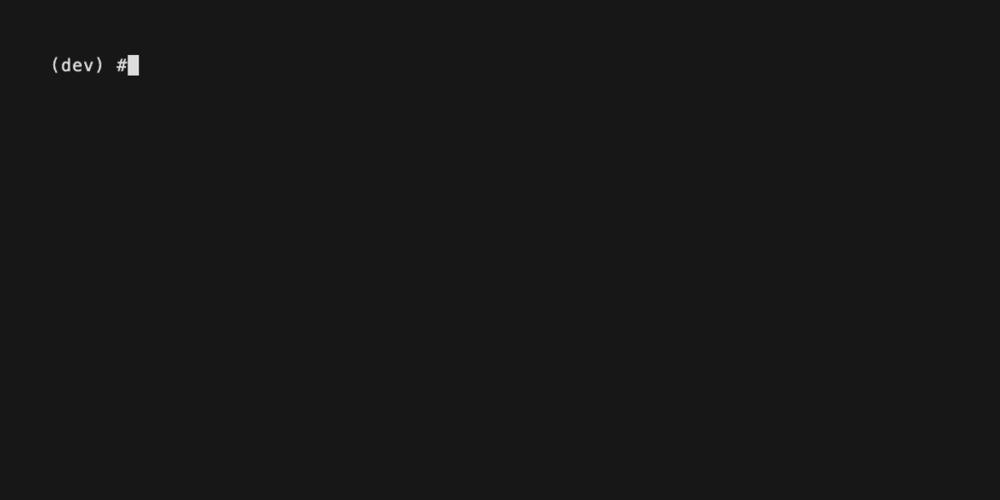
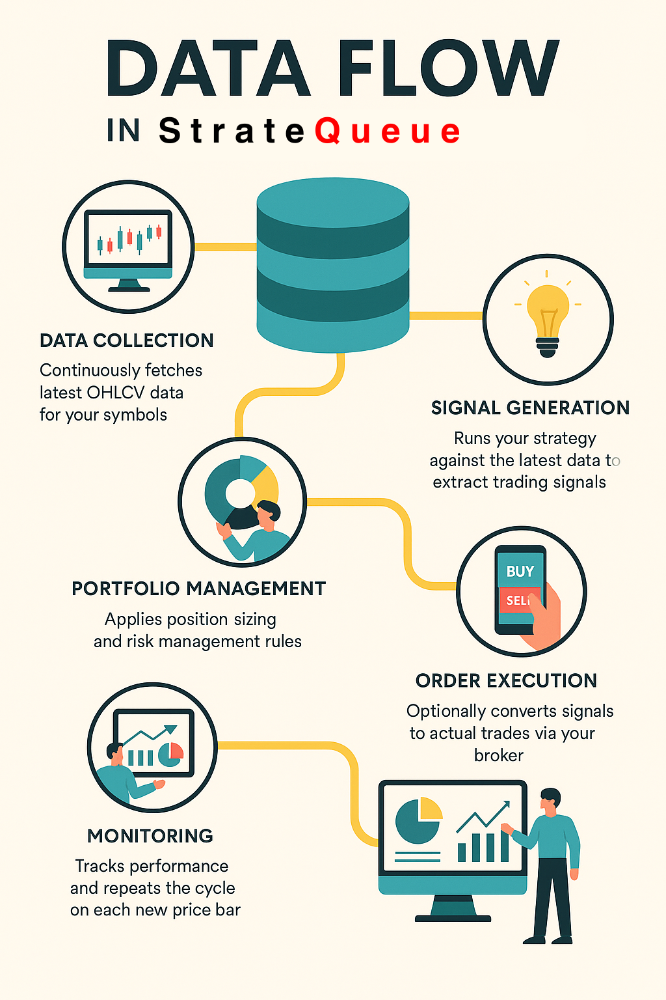

# StrateQueue [](https://twitter.com/intent/tweet?text=Take%20your%20zipline,%20vectorbt,%20backtesting.py,%20or%20backtrader%20strategies%20live%20with%20zero%20code%20changes&url=https://stratequeue.com&hashtags=python,backtesting,trading,zipline,vectorbt,quant) 

[](https://badge.fury.io/py/stratequeue)
[](https://pypi.python.org/pypi/stratequeue/)
[](https://www.python.org/downloads/)
[](https://github.com/StrateQueue/StrateQueue/blob/main/LICENSE)
[](https://github.com/StrateQueue/StrateQueue/graphs/contributors)
[](https://pepy.tech/project/stratequeue)


[](https://github.com/StrateQueue/StrateQueue/stargazers)
<!---[](https://codecov.io/gh/stratequeue/stratequeue)-->

**[Documentation](https://stratequeue.com/docs)** | **[Quick Start Guide](https://www.stratequeue.com/docs/quick-start)** | **[Community](https://discord.gg/H4hWAXJYqX)**

> **The fastest way from backtest to live trading**
[](https://github.com/StrateQueue/StrateQueue/stargazers)

> If StrateQueue saved you time or taught you something, consider [starring us on GitHub](https://github.com/StrateQueue/StrateQueue) — it helps more quants discover the project!

## StrateQueue

Backtest to live in seconds. StrateQueue lets you deploy any Python trading strategy (**backtrader**, **zipline**, **vectorbt**, **backtrader**, etc.) to any broker with one command: ```stratequeue deploy --strategy ./your_script.py```. No code changes.

## Table of Contents
- [StrateQueue ](#stratequeue-)
  - [StrateQueue](#stratequeue)
  - [Table of Contents](#table-of-contents)
  - [Quick-start: From Backtest to Live in One Command](#quick-start-from-backtest-to-live-in-one-command)
    - [Your existing backtest:](#your-existing-backtest)
    - [Deploy to live trading:](#deploy-to-live-trading)
  - [Prerequisites](#prerequisites)
  - [Installation](#installation)
    - [Setup](#setup)
    - [Dashboard (Experimental)](#dashboard-experimental)
  - [Supported Integrations](#supported-integrations)
  - [Why StrateQueue?](#why-stratequeue)
  - [How It Works](#how-it-works)
  - [Star History](#star-history)
  - [Disclaimer – No Investment Advice](#disclaimer--no-investment-advice)
  - [License](#license)

## Quick-start: From Backtest to Live in One Command
### Your existing backtest:
```python
class SMAStrategy(Strategy):
    def init(self):
        self.sma_short = self.I(ta.SMA, self.data.Close, 10)
        self.sma_long = self.I(ta.SMA, self.data.Close, 20)
    
    def next(self):
        if crossover(self.sma_short, self.sma_long):
            self.buy()
        elif crossover(self.sma_long, self.sma_short):
            self.sell()
```

### Deploy to live trading:
```
pip install stratequeue
stratequeue deploy \
  --strategy examples/strategies/backtestingpy/sma.py \
  --symbol AAPL \
  --timeframe 1m
```

NOTE: To use CCXT, use the ```--broker/data-source ccxt.<broker>``` syntax



## Prerequisites

- Python **3.10** or newer (tested up to 3.11)
- pip and a virtual environment (recommended)
- (Optional) Broker API credentials if you plan to trade live (e.g. Alpaca, Interactive Brokers)
- (Optional) A C compiler for building certain dependencies (TA-Lib, IB-API) on Linux/macOS

## Installation

Install the core package:

```bash
pip install stratequeue
```

If you need support for a specific engine or want everything in one go:

```bash
# Zipline support
pip install "stratequeue[zipline]"
# Backtrader support
pip install "stratequeue[backtrader]"
# Backtesting.py support
pip install "stratequeue[backtesting]"
# VectorBT support
pip install "stratequeue[vectorbt]"
# BT support
pip install "stratequeue[bt]"
# Everything
pip install "stratequeue[all]"
```

### Setup


### Dashboard (Experimental)
```bash
stratequeue webui
```

## Supported Integrations

| Integration | Status |
|-------------|--------|
| **Backtesting Engines** | |
| ├─ backtesting.py | Implemented |
| ├─ VectorBT | Implemented |
| ├─ Backtrader | Implemented |
| ├─ BT | Implemented |
| └─ Zipline-Reloaded | Implemented |
| **Brokers** | |
| ├─ Alpaca | Implemented |
| ├─ Interactive Brokers | Implemented |
| ├─ CCXT | Implemented (not tested) |
| **Data Providers** | |
| ├─ yfinance | Implemented |
| ├─ Polygon.io | Implemented |
| ├─ CoinMarketCap | Implemented |
| ├─ Alpaca | Implemented |
| ├─ Interactive Brokers | Implemented (not tested) |
| ├─ CCXT | Implemented (not tested) |
| └─ **[Qoery](https://qoery.com)** (Cheapest) | **Use code `STRATEQUEUE25` for 25% off (Basic, Analyst, Lite0)** |

## Why StrateQueue?

**Safe by Default** — Signals-only mode by default. No accidental trades.

**Engine Agnostic** — Works with backtesting.py, VectorBT, Backtrader, Zipline-Reloaded, bt, and more coming soon.

**Multi-Broker** — Unified API across IBKR, Alpaca, and 250+ more brokers.

**Portfolio Management** — Deploy single strategies or manage hundreds across multiple accounts

## How It Works



## Star History

[](https://www.star-history.com/#stratequeue/stratequeue&Timeline)

## Disclaimer – No Investment Advice

StrateQueue is an open-source toolkit provided **"as-is" for educational and informational purposes only**.
* It does **not** constitute investment advice, brokerage services, or a recommendation to buy or sell any financial instrument.
* All trading involves substantial risk; **past performance is not indicative of future results**. You may lose some or all of your capital.
* By using StrateQueue you acknowledge that **you alone are responsible for your trading decisions** and agree that the StrateQueue maintainers and contributors will **not be liable for any loss or damage** arising from the use of this software.
* Consult a qualified financial professional before deploying live capital.
  
## License

StrateQueue is released under the **[GNU Affero General Public License v3.0](LICENSE)**.
